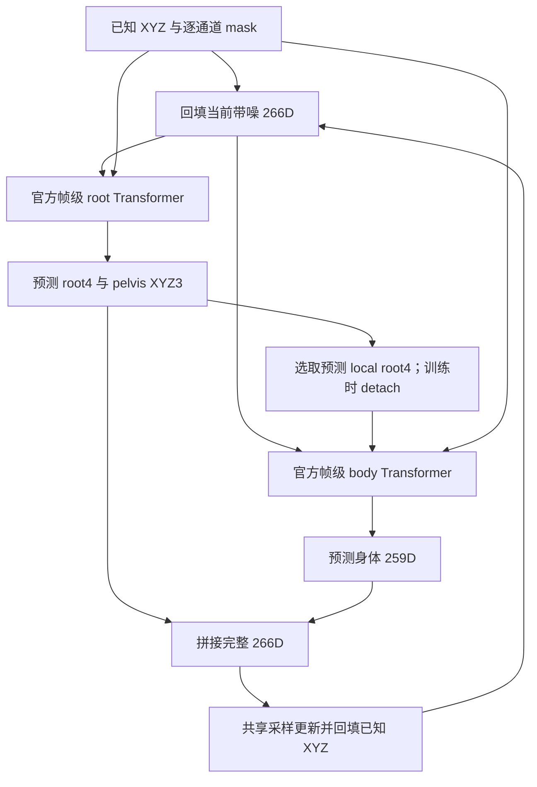

# OF008：Kimodo 官方两阶段骨干的 266D 位置控制适配

2026-09-26。状态：本地实现和 CPU 验证完成，未租用 GPU，未运行新训练。用户要求尝试 Kimodo 架构，随后明确“只要使用类似的控制注入方法即可”。据此保留现有 266D、位置控制、无文本设置，复用官方网络，避免为原生 Kimodo 表示额外输入真实 root 信息。

## 本轮问题与判断边界

问题是：使用 Kimodo 的帧级、root/body 两阶段 Transformer，能否在同一单动作三状态任务上学出此前 Wan 没有学出的控制响应？

若成功，说明当前训练数据至少能支持这条条件映射，骨干/优化组合值得追查。若失败，只说明两个实现都未在本轮设置下通过，不能证明架构无关，更不能唯一归因为训练量。两者共有数据、目标、位置控制与采样器；这些仍可能是瓶颈。只有增加训练步数等独立干预后，才能检验训练量假设。

## 官方来源与直接复用范围

官方仓库：[nv-tlabs/kimodo](https://github.com/nv-tlabs/kimodo)，固定提交 `58e781898b3d7e328a676a75d3e338c45dce3ad9`。已下载本地 `third_party/kimodo`，代码未修改，Apache-2.0 许可保留。源码归档 SHA256 为 `bd6bc0b7930c4a9b7164c8ab418c8238eed785d58c7dc34700524bbb211a878f`。

直接加载官方 `model/backbone.py` 的 TransformerEncoderBlock 和 `model/twostage_denoiser.py` 的 TwostageDenoiser。加载器只跳过会连带加载 UI/LLM 的包初始化，不替换网络实现。逐文件哈希已记录并在运行前验证。

参数依据官方 [SOMA-SEED-v1.1 配置](https://huggingface.co/nvidia/Kimodo-SOMA-SEED-v1.1/blob/main/config.yaml)：每阶段 16 层、宽 1024、8 头、FFN 2048、GELU、post-norm、dropout=0、PE dropout=0、50 个前缀内容 token。沿用官方正弦位置编码、时间前缀 token 和参数初始化。没有把它改写成 Wan/AdaLN。

## 控制注入与 266D 衔接

控制输入仅包含用户给出的世界 XYZ。每次调用网络前，已知 XYZ 被干净值替换；与逐通道二值 mask 拼接。官方 root、body 两阶段均接收 mask。旋转、速度、接触和未观测 root 特征仍是未知通道，不提供它们的 GT。已知 XYZ 初始化和每步更新后回填，sigma 恒为零。

266D 排列保持现有定义：root4 + world XYZ66 + 局部 rot6d126 + 局部速度66 + contact4。按原有连续通道划分：

- root 阶段输入全部 266D 运动和 266D mask，输出前 7D，即原 root4 加显式 pelvis XYZ3。
- body 阶段接收模型预测的 local root4、当前带噪的后 259D 身体特征，以及完整 266D mask；输出后 259D。
- root4 已是现有局部 root 表示，所以适配器直接选取预测值的前四维，不再积分或差分。保留官方训练时 root→body 的 detach 行为；root 阶段由自身输出监督训练。
- 输出拼回原 266D；控制回填仍由共享采样器完成。

这是 **Kimodo 官方网络组件的 266D 适配**，不是原生 Kimodo 完整复现。原生模型预测平滑 global root5，再转换为 local root4，并采用另一套身体表示。本轮不使用其原生表示或预训练权重，避免额外的 GT root 条件和表示转换同时进入试验。两阶段拆分的适配本身也属于待验证假设。

## 时间、文本与损失

本轮继续使用 OF006/OF007 的传统 inpainting 均匀未知时间场：未知通道 sigma=1−k/32，已知 XYZ sigma=0。Kimodo 的时间前缀接收 round(1000*sigma_unknown)，仅用作官方正弦时间表索引；仍运行现有 32 步 x0 flow 更新，不宣称改成了原生 DDPM/DDIM。遇到非均匀关节时间场会明确报错，绝不通过平均 sigma 隐藏不兼容。

延续用户此前的无文本控制诊断：不加载 LLM2Vec 或 UMT5，不传入 caption。50 个零内容前缀 token 经官方可训练线性层和位置编码处理；没有实际文本信息。关闭第一帧朝向 token，不额外读取 GT heading。

训练沿用未知活动通道归一化 x0 MSE，加 0.01 现有 root/速度一致性损失。未加入 Kimodo 论文的分组 Smooth L1、FK 损失、两阶段训练课程、EMA、CFG 或优化后处理。因此本轮只回答架构适配在现有训练协议中的效果，不能将失败归为 Kimodo 方法整体失败。

## 数据、训练与比较

同一 HumanML3D 动作 011936，64 帧；训练状态 −12/0/+12°，未训练状态 ±6°。控制布局训练 A，测试 A/D。状态库 `prepared/OF003/states.npz` 和元数据哈希保持原值；GT 旋转扰动、FK 与速度重算流程保持原值，不重新合成数据。

从随机初始化训练 **4,000 步**，batch=3，seed=1234，噪声种子 1235。AdamW lr=2e-4、betas=(0.9,0.99)、eps=1e-8、weight decay=0、100 步预热、梯度裁剪 1。FP32 参数、BF16 autocast。前 400 步 teacher，之后 50% 模型 rollout，最后四步保留梯度。归一化固定到同一三训练状态，训练完与冻结 OF006 normalizer 逐元素核对。

适配模型 **282,752,266 参数**，原 Wan 基线 78,053,389 参数。本轮是相同步数/样本呈现次数，不是等参数量或等 FLOPs 的一因素比较。token 从关节帧变为整帧、时间注入从 AdaLN 变为前缀、网络容量和两阶段拆分同时变化，均需披露。相同学习率也不保证适配模型已经得到最佳优化。

## 评估及预定门槛

训练入口保留 80 例常规评价（A/D × 五角度 × 八噪声）。另复用 OF007 的 160 例共同评价（A3/A15/D3/D15 × 五角度 × 八噪声），160 份全部保存。主比较只用 A3/D3 的 80 例，其中 64 个非零角度响应；A15/D15 是次要诊断，不能代替主结果。

基线使用已完整保存和审计的 OF007 baseline_eval，即冻结 OF006 checkpoint 的相同 160 例。主指标在相同 48 个自由关节帧位置上计算，排除四种布局固定点的并集；改变角度时复用同一噪声，模型间也复用同 seed。目标 gain=1/error=0；通过标准仍为 gain∈[0.5,1.5] 且 relative error<0.5，每布局/角度至少 6/8 噪声通过。

同时报告全局与局部 MPJPE、FK/XYZ 不一致、旋转/速度误差、骨长误差、逐步锚点精确性和实际/目标变化 RMS。合计 240 次生成包含重叠条件，不是 240 个独立统计样本。一个训练 seed 不能支持跨训练种子的显著性结论。本轮不运行正式 FID、文本匹配、BABEL、流式延迟或全数据训练。

## 已完成的本地验证

46 项 CPU 测试通过，包括官方 forward 与适配器输出一致、padding 隔离、位置通道专用 mask、root/body 真实梯度与官方 detach 行为、拒绝不支持的时间场和文本、真实模型 rollout 中每步锚点保持、自由输出到控制输入存在梯度路径。最后一项只验证计算图连接，不等于学会控制。

额外通过 batch3、64 帧、266D 的小宽度 BF16 rollout/backward 检查：使用完整 32 步格点，执行前四步、后两步求梯度。主规模模型仅完成 meta 构造和参数量统计，尚未在 CPU 或 GPU 验证完整训练步的显存/耗时；不能提前声称运行性能已验证。

## 资源、运行门禁与停止规则

计划一个 RTX4090 或同预算单卡，实际租用前读取价格，单价不高于 $1/小时。分配时间最长 **90 分钟，总上限 $2**；训练入口最长 75 分钟，保留末 300 秒评价。若 OOM、非有限损失、源码/配置哈希变化、时间不足或未完成 4,000 步，停止并标记未完成，不自动缩网络、换损失或追加训练。

入口 `scripts/run_of008.sh`；配置 `configs/kimodo266_overfit_v1.json`；审批 `approvals/of008-kimodo266.json`。旧输出目录存在即拒绝重复运行。结束时取回日志与样本、核验哈希，保存 checkpoint 到原卷 k1j34iuc97，销毁任务 Pod。存储费用另计。

此前免逐次审批授权明确限于已标准化骨干的过拟合/小样本测试；本次更换 Kimodo 骨干，按最初“运行前提交详细方案并通过”的要求，将此报告提交后再启动付费实验。目前审批记录为 false，没有创建 Pod 或提交 GPU 任务。
